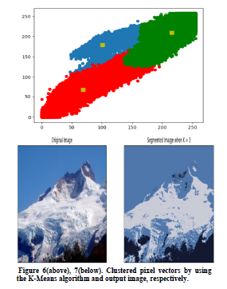
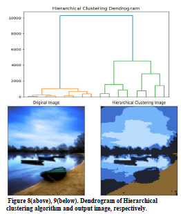
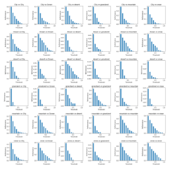
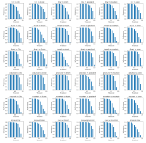

<h1 align="center">Zero-Shot Photo Frame Recommendation</h1>

  

## Overview
This project introduces a novel methodology for recommending personalized photo frames using image similarity and segmentation techniques. By employing hierarchical clustering and K-Means clustering, we segment images and recommend frames by measuring similarity with user-provided photos using a histogram-based method. This approach aims to enhance the efficiency and accuracy of image-based recommendation systems.
(This project was carried out at the AML class for the fall semester of 2023.)

  

## Key Features
- **Image Segmentation**: Utilizes hierarchical and K-Means clustering to segment images, with the optimal `K` value determined by the Elbow method.

  
  

- **Frame Recommendation**: Recommends photo frames by comparing the similarity of segmented images to user photos, based on histogram correlation coefficients.

- **Similarity Threshold**: Sets a specific similarity threshold for recommendations, ensuring relevance and precision in frame suggestions.

  
  

## Methodology
1. **Clustering for Image Segmentation**: Applies hierarchical clustering for detailed segmentation and K-Means clustering for efficient processing. The Elbow method is used to determine the optimal `K`.
2. **Histogram-Based Similarity Measurement**: The system compares histograms of user images and potential frames to identify the most suitable match, quantifying similarity with correlation coefficients.
3. **Dynamic Frame Recommendation**: Frames are recommended only if their similarity to the user's photo exceeds a predetermined threshold, enhancing the relevance of suggestions.We calculated the similarity for all images and found the threshold. This is a kind of hyperparameter. A high threshold recommends an accurate frame, but a small amount of frame is recommended. A low threshold is not accurate, but various frames may be recommended to the user.

  

## Dataset
The project utilizes a diverse dataset collected from Kaggle and Google, encompassing various landscapes to validate the model. This includes labeled and unlabeled images across several categories such as city, desert, mountain, snow, grasslands, and sea.

## Usage
- You can segmentate images using the provided [`hierarchical_clustering-1.py`](hierarchical_clustering-1.py) and [`k_meansclustering-1.py`](k_meansclustering-1.py) scripts.
- Calculate image simillarity using [`image_simillarity(1).py`](image_simillarity(1).py)
- Set image threshold using [`set_image_thresholds.py`](set_image_thresholds.py)
- Make Your OWN FRAME! [`validation_and_accuracy-1.py`](validation_and_accuracy-1.py)

  

